# (Hierarchically) clustering words across narrative time

I wanted to pick back up quickly with that list of the 500 most "non-uniform" words at the end of the last post about word distributions across narrative time in the American novel corpus. Before, I just put these into a big ordered list, arranged by the center of mass of each word's distribution, which gives a pretty good sense of the conceptual gradient from beginning to end. For example, the 30 most beginning-heavy words. But, it's easy to see that the center-of-mass metric is papering over some interesting differences. For example, "girls" sits right next to "eighteen," both of which are clearly beginning words, in the sense that they're high at the beginning and low at the end:

But, in terms of the actual shape of the distribution, "girls" looks much closer to "manners," which sits nine positions to the left, or "liked," seventeen positions to the right:

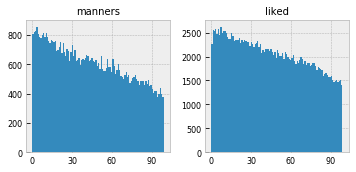

"Eighteen" has a huge spike at the very beginning, presumably being used in the context of giving a character's age when they first appear, but then is basically flat across the rest of the text; whereas "girls" maybe actually peaks just *after* the beginning, and then fall off linearly across the narrative. This seems like a meaningful difference - I'd suppose, "girls" is somehow contributing less to the work of "world-building," the process of rendering the fictional world into existence at the very start, and marking something else. (But what?)

How to hook onto these kinds of distinctions more precisely? Beyond the (literally) one-dimensional notion of a "center" of a word, how to slice the dictionary into groups and cohorts, little rivulets that run through the prototypical narrative? To circle back to the original question from Textplot, back in 2014, but now applied to a big stack of 27k novels instead of just one - which words "flock" together across narrative time, ebb and flow in the most exactly similar patterns? This is similar to what [David Mimno did with Matt Jockers' intra-text topic model data](https://mimno.infosci.cornell.edu/novels/plot.html), though coming from a slightly different direction. Instead of starting with topics in the normal sense - groups of words that tend to show up in close proximity in individual texts - the idea here is to group words based on their cumulative "arcs" across lots of texts, regardless of whether they actually hang together in individual novels. What are the most salient *narratological* topics, groups of words that fluctuate across narratives in the exact same patterns?

One simple approach is just to do a basic hierarchical cluster of the distributions. Here, I converted the raw percentile counts for each word into density functions, and then just took the raw euclidean distance between each pair of words. (As I mentioned before, this is iffy when comparing words with very large differences in overall frequency, and, in this case, has the effect of lumping in all of the high-frequency words with the "middle" words, even when they actually have really interestingly skewed distributions. But again - this is another can of worms.) Then, I handed the distance matrix over to SciPy's `dendrogram` function to compute the hierarchical cluster, using the "ward" linkage method. I ended up running this on the 1,000 most non-uniform words, not just the top 500, which gives a bit more specificity to some of the clusters. The final render is huge (click to show full size):

The nice thing about hierarchical clustering is that you don't have to make many decisions going in - just the distance and linkage metrics. But, the downside is that interpreting this is a bit subjective, mainly because there's no hard-and-fast answer as to where you should "cut" the dendrogram, how high up the tree you should go before breaking off a cluster of words to look at. Here, I've set the coloring threshold at 0.01, meaning that any words / groups that were merged together with a distance of less than 0.01 (under the "ward" metric) get the same color. This seems to give fairly sensible clusters for this data - here are plots for all of these clusters with at least 3 words:

Really this is probably a bit too granular, since there are a number of groups that have similar profiles and seem to hang together at some kind of topical / conceptual level. But, I think it's useful to err in the direction of too granular instead of too coarse, since there are some cases where the lower threshold splits out groups that seem interestingly different (for example, the "family" and "dialogue" words, discussed below).

## Beginnings

Here's my less-than-scientific gloss on this, where, in the interest of shortness, I've often merged a hanful of groups back together into higher-order groups. To start, at the beginning - there's a big cohort of words that all have something to do with the description of people and objects - age (sixteen, seventeen, eighteen, younger, older), body size (tall, stout, slender), personal qualities (graceful, educated), physical materials (wooden, leather, cotten), etc. These peak out in the first percentile, fall off sharply in the first ~10%, and then decline more gradually across the middle, with some spiking slightly again at the very end:

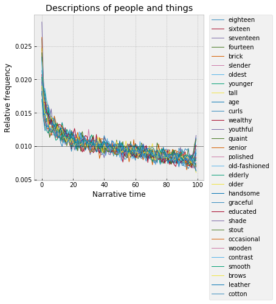

This makes sense - the fictive world has to get sketched into existence at the start; a movie or play can just show things, but a novel has to explicitly describe them, the novelist has to manually "render" the world of the story.

Education also happens at the very beginning, though the word "education" itself also ticks up slightly at the end, which I'm not sure about - maybe education in a more general sense, the protagonist having received an education of some sort over the course of the plot, not education in the literal sense of school, college?

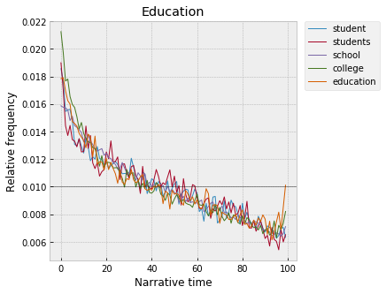

Beyond words that just show up at the beginning - there's an interesting set of clusters that are strong at the very beginning, flat across the middle of the text, but then also high at the very end. These all have to do with physical setting, essentially - cardinal directions (north, south, east, west, northern, southern), features of the physical landscape (mountains, fields, hills, waters), actual place names (America, American, England, York), and the sort of human experience of the outdoors (sky, horizon, wide, vast, distant).

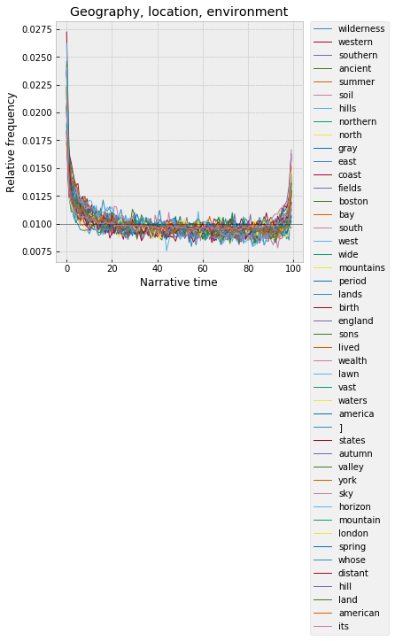

Which I guess goes hand-in-hand with the descriptions of people and things - this is the narrative hammering together the "stage" of the narrative, in the broadest sense, the *place* of the text. Though, the spike at the ending is less clear to me. Why return to the physical setting at the very end, once when the world has already been blocked into existence by the beginning? (And surely, at the end, the narrative isn't crossing into new fictive territory that needs to be described for the first time?) Maybe, to use film as an analogy - if we think of the narrative as a kind of "camera" onto the world, this is the camera panning out at the end, pulling back into a wide shot of the landscape of the story - the characters gazing out contemplatively over the mountains, plains, valleys, seas? A kind of reciprocal "wide shot" to match the scene-setting of the beginning? Like in Howards' End, maybe, when, at the very end, everyone goes outside and looks at the "field" and "meadow" behind the house. The last two paragraphs:

> From the garden came laughter.  "Here they are at last!"
exclaimed Henry, disengaging himself with a smile.  Helen rushed into the gloom, holding Tom by one hand and carrying her baby on the other.  There were shouts of infectious joy.

> "The **field**'s cut!"  Helen cried excitedly--"the big
**meadow**!  We've seen to the very end, and it'll be such a crop of hay as never!"

Or, to stick with Forster, the last paragraph of *A Room with a View*:

> Youth enwrapped them; the song of Phaethon announced passion requited, love attained. But they were conscious of a love more mysterious than this. The song died away; they heard the **river**, bearing down the snows of winter into the **Mediterranean**.

Along the same lines - "sun," "sunlight," and "sunshine" are high at the beginning and the end:

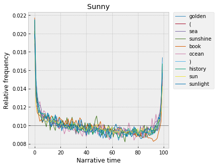

But also "clouds," "snow," and "shadows," which, unlike sunshine, are flat across the middle, instead of falling off to a low point around 80%. (Not sure how much can be made of those kinds of small differences, which could always just be noise in the sample. Though also not sure that nothing should be made of them, since N here isn't small.)

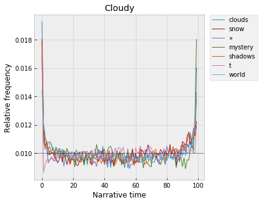

Words related to family are also strong at the beginning, though with a twist - unlike the description words, which are highest in the very first percentile, family words start relatively lower and then spike up to a peak in the second, third, fourth percentiles, before falling off more gradually across the first half of the narrative and then rising slightly at the end. As if - the narrative starts with world-building, and then turns to characters, where the first order of business is to lay out the family tree, fill in the edges of the graph?

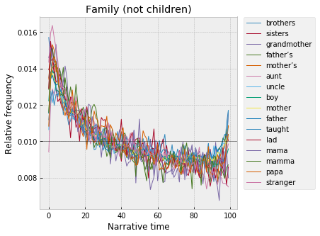

This also seems to have something to do with childhood and youth, with "mama," "mamma," "papa." Though interestingly, words explicitly about children and childhood break off cleanly into a separate cluster, which rises much higher at the end:

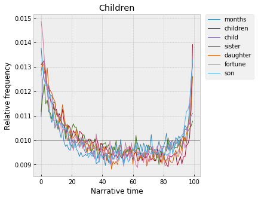

Again, "childhood" at the beginning makes sense - narratives map onto lives, are told in chronological order, etc. And I suppose that "childhood" at the end is, basically, the consummation of the marriage plot? "Childhood" in the first percentile is the childhood of the protagonist, and "childhood" in the 99th percentile is the childhood of her children?

Next in order, moving away from the start - a series of clusters of words related to entertainment, fashion, social interaction, and, notably, women, all of which rise quickly at the start, reach a relatively broad peak around 10%, and then fall of in a sort of convex arc. First, with the highest peak, around 10-15% - "girls," "amused," "amusement":

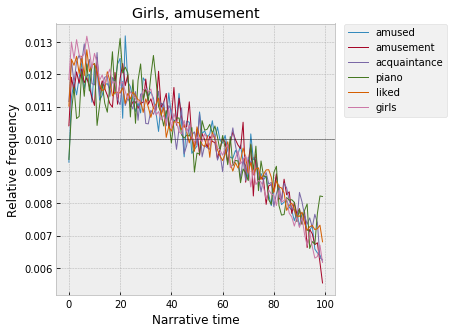

Or, "girl," "pretty," "wear," "dress":

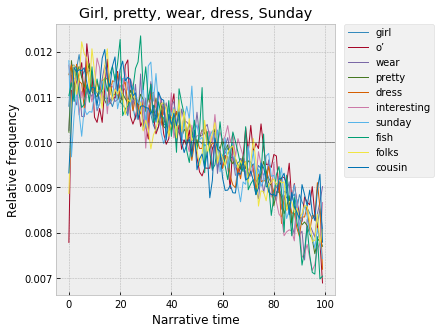

And, with somewhat less of that initial rise in the first couple percent, "women," "clothes," "table," "manner":

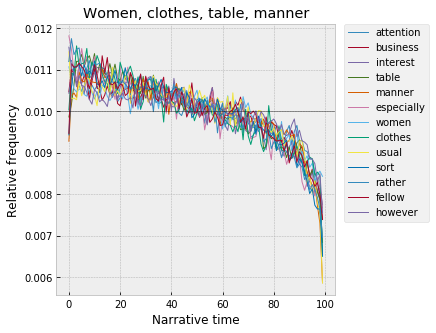

Along with women and fashion, this is also very notably the arc of *food*, which creeps in above with "fish" and "table." Also peaking around 10% - "breakfast," "supper," "meal," "beer," "coffee," "tea":

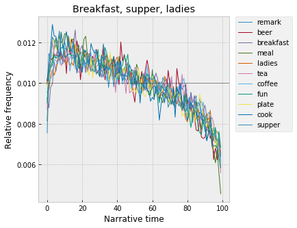

And, interestingly, a fairly distinct second food cluster, which rises more gradually to a peak around 20% - "lunch," "wine," "eat," "dinner," and also words like "conversation," and "dance" - which make me think of  soirees, dinner parties, balls, gatherings that are more formal, that take place at night?

So, a kind of anatomy of beginnings starts to come into view. First, descriptions of physical setting, places, things, weather, and (the appearance of) people; then family relations and childhood. And then, once the work of world-building is complete, once the stage and props and characters have been described into existence - it's as if the narrative kicks off in earnest with some kind of social gathering or a meal, a first scene or set piece where the characters (mostly women?) are shown dressed fashionably, sitting around the table, at ease and enjoying themselves, before the complications of the plot ensue - Anna Pávlovna's soiree, at the start of *War and Peace*, the first dinner at the Bertolini in *A Room with a View*? A meal at 10%, a dance at 20% - how many individual novels do this?

## Ends

Meanwhile, at the end - first of all, sort of mirroring the food / amusement cohorts that peak just after the start - a series of clusters that peak just before the end, around 90-95%, all having something to do with violence. The highest peak is murder, generally with guns:

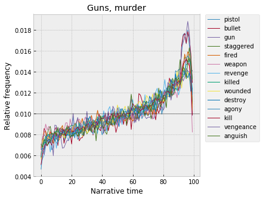

And the trial, which looks very similar to what Ben Schmidt saw with the TV scripts, here probably driven by suspense and mystery novels:

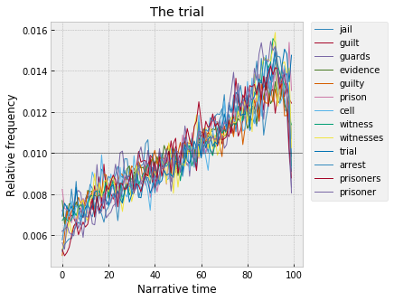

And I think this is war - "enemy," "attack," "guard," "escape"?

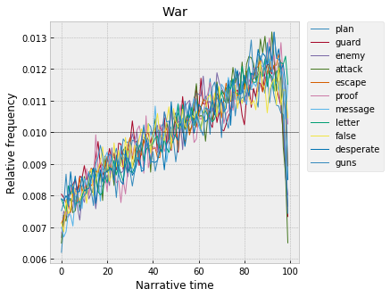

I guess these peaks are the "climax," basically? Finally, at the very end, words that peak in the 99th percentile - some endings are happy, filled with joy, happiness, tender embraces, kisses, eternal faithfulness:

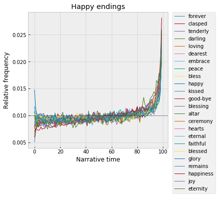

Related, the marriage plot, which is the single strongest signal of any of these, just by the height of the spike:

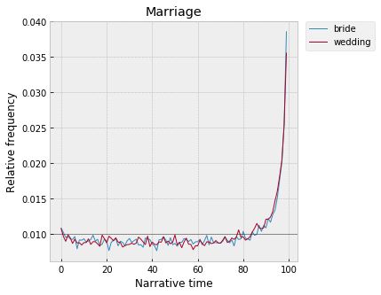

And, Brooks / Barthes / Kermode and friends were right, endings also tend to be about death:

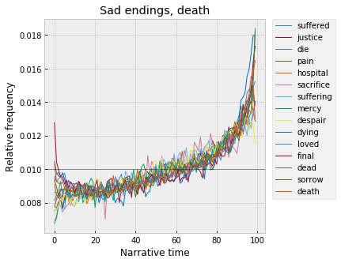

## Middles?

What about the middle? Middles are relatively sparse, in this set of 1,000 words, though, in part, I think this is a function of how I'm skimming off words to look at, and how the counts were tallied up in the first place. Really just two things pop out, and, in both cases, it's not so much that the clusters are "peaking" in the middle, and  more just that they're misisng at the beginning and end. The most exactly middle-heavy cluster is probably this one, which clearly corresponds to *dialogue* - quotation marks and contractions, and those `"<word>` tokens, which are actually errors, places where the OpenNLP tokenizer is failing to split the quotation mark away from the first word in the sentence.

And this cluster, which is a little more scrambled, but I think also marks conversation - "question," "talk," "why," and more contractions:

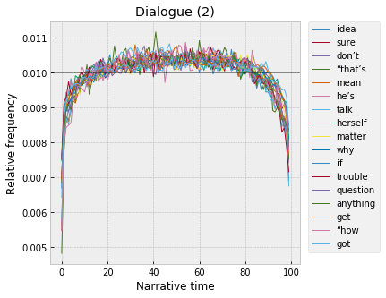

Interestingly, there's a third dialogue cluster, which looks broadly similar but peaks significantly later, around 80%, and, in addition to the dialogue tokens, also includes a set of words that seem to describe mental states or intentions - "understand," "try," "believe," "know," "feel," "wish," "want":

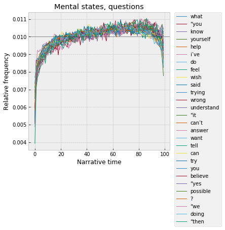

Though it's interesting that "think" gets clustered with that first group, which peaks right in the middle.

So, middles are - speaking and thinking, dialogue and psychological interiority? That rings true, but I also think it's probably not the full picture. First, it might be that the most middle-heavy words aren't making it into this cut of 1,000 words, which, as I mentioned before, is based on one particular scoring metric (among many possible alternatives) that tends to reward relatively frequent words.

More broadly, I also wonder if the process of normalizing the text lengths has the effect of sort of "blurring out" the structure of the middle, and giving a clear picture of just the beginning and the end. For example, imagine that there were some kind of event / function / trope that tends to happen at a *fixed*, not relative, distance from the beginning or end - eg, a thunderstorm always happens right around 10,000 words from the beginning, or whatever. If the novel is 50,000 words long, this would get mapped onto the 20% marker. But, if the novel is 100,000 words long, it would get put at 10%, etc. This seems clearly problematic, but I also don't think there's an easy solution that doesn't introduce other problems. For example, if we don't normalize the lengths at all, and compare the 50,000 word novel directly to the 100,000-word novel - then, words at the very end of the 50k novel would get compared to words at the exact middle of the 100k novel, which also seems weird. (Though I'd be curious to try this anyway, and see what happens, possibly starting from different fixed "anchor points" in the narrative - plot time-series trends for words in terms of raw distance from the beginning, moving foward; from the end, moving backwards; or from the 25% / 50% / 75% markers, moving backwards and fowards, etc.)

Anyway though, most of this isn't super surprising. Where it gets more interesting, I think, is with the really high-frequency function words, which turn out to have very irregular trends across the narrative, often in ways that seem to give a kind of keyhole view onto something more fundamental, a kind of underlying narrative "physics" that sits below the birth / death / murder / marriage conventions. I'll write more about this soon, but quickly - check out "and" and "or":

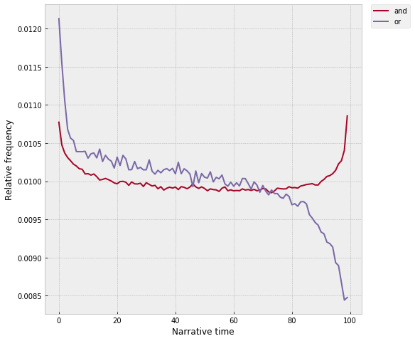
