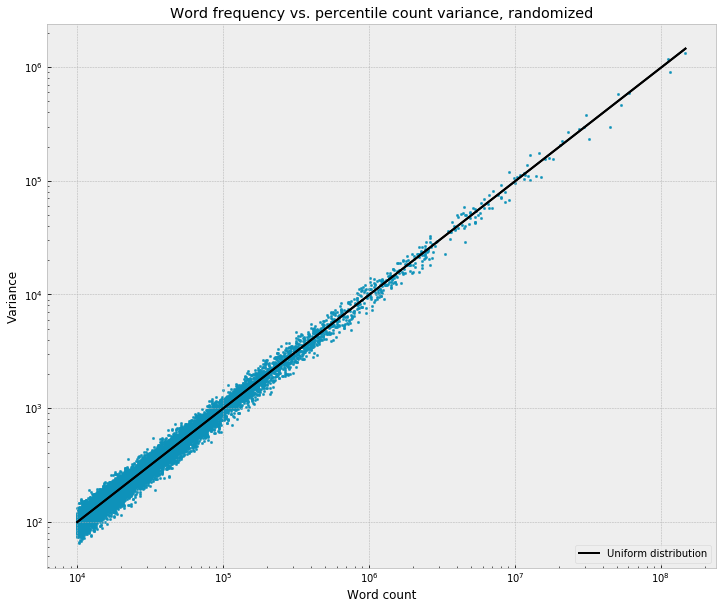

# Distributions of function words across novels

Last week I took a look at some of the ["cohorts" that were produced by a hierarchical cluster of the distributions of words across narrative time](https://litlab.stanford.edu/hierarchical-cluster-across-narrative-time/) - groups of words that tend to rise and fall together across the plot, when averaged out across thousands of novels. One side-effect of this kind of exploratory approach, I think, is that there's a tendency to focus on the more semantically "focused" signals that are easy to map back onto the experience of actually reading individual novels. For example, it's not hard to reason about what's going on with cluster 37 (pistol, bullet, gun) or 139 (student, students, school). Which, as [Ted](https://twitter.com/Ted_Underwood/status/892445002978250752) and [Scott](https://twitter.com/scottenderle/status/892466165343293440) pointed out on Twitter, might tell us more about the presence of different genres in the corpus than about "narrative," in any kind of general sense.

But, what to make of something like cluster 10? This seems more muddled, and, notably, includes a number of stopwords - "a," "an," "or," "than," "these" - all of which made it into the initial cut of the 1,000 most narratologically "uneven" or "non-uniform" words.

Which, it turns out, isn't a fluke. Function words tend to have *very* strong trends across narrative time. In fact, stronger than almost anything else in the dictionary. Take a look again at this graph from a couple weeks ago, which plots the the non-uniformity of each word as a function of its frequency:

The Y-axis is just the raw variance of the word's frequency across each percentile of the novel, which gives a crude measure of "unevenness," the degree to which a word is rising and falling across the narrative. The black line represents the null hypothesis, basically - the amount of variance that we'd expect under the uniform distribution, if everything were just random noise. By dividing the observed variance by this theoretical baseline, we can get a simple score for the "unevenness" of the word, how many orders-of-magnitude it is above what it would be if it were flat across the text.

Before, I focused on the fact that almost all of the words fall above this line, which corresponds to the fact that most words are significantly different from the uniform distribution and have some kind of "trend" across the novel. But, that's not all. It's also clear that the slope of the data is higher than the slope of the line, that words rise higher above the line as frequency increases - on the left side of the graph, the highest-scoring words sit about 2 orders of magnitude above the baseline; at the right side, this rises to about 3. Words seem to become *more* uneven as they become more frequent, even after adjusting for the expected correlation between frequency and variance.

Indeed, when we use this metric to skim off a set of the most non-uniform words, we end up getting a large majority of the most frequent words and a much smaller slice of the less frequent words. For example, if we take the 200 highest-scoring words, we get 60 out of the 100 most frequent words in the corpus:

> 
end, <b>you</b>, chapter, <b>a</b>, <b>of</b>, <b>the</b>, <b>i</b>, <b>.</b>, chapter, <b>?</b>, i., ii, years, <b>”</b>, <b>!</b>, <b>said</b>, <b>me</b>, iii, <b>“</b>, <b>him</b>, young, <b>she</b>, 2, 3, <b>he</b>, <b>to</b>, <b>her</b>, its, <b>”</b>, <b>will</b>, i., father, school, <b>what</b>, <b>and</b>, hair, mother, god, age, <b>”</b>, tall, ), death, love, the, <b>that</b>, (, <b>,</b>, year, brown, <b>have</b>, happy, <b>now</b>, life, <b>it</b>, <b>not</b>, <b>we</b>, <b>your</b>, <b>in</b>, <b>"</b>, happiness, <b>an</b>, new, joy, boy, <b>or</b>, 5, <b>if</b>, wedding, vii, dead, 6, again, <b>"</b>, old, family, <b>do</b>, blue, small, <b>which</b>, viii, l, iv, heart, large, <b>did</b>, published, book, gun, miss, girls, arms, do, 9, girl, <b>would</b>, ix, <b>could</b>, <b>his</b>, tell, <b>”</b>, kill, bride, told, <b>was</b>, college, always, black, letter, <b>has</b>, 8, don’t, <b>can</b>, <b>back</b>, tears, know, author, last, forgive, shall, asked, go, <b>be</b>, die, mr., saw, <b>had</b>, broad, handsome, hand, gray, must, <b>then</b>, 7, <b>about</b>, fiction, think, <b>n’t</b>, edition, books, boys, <b>little</b>, <b>my</b>, <b>is</b>, cried, <b>their</b>, us, younger, summer, older, prisoner, love, xii, 1, green, <b>by</b>, “you, stranger, vi, beauty, dying, grave, done, novel, village, readers, xiii, world, youth, 22, children, york, kissed, born, think, know, love, 13, mrs., town, rich, killed, story, 23, 21, still, 12, &amp;, whose, very, wife, <b>from</b>, went, <b>some</b>, nose, 24, v., pain, see, <b>like</b>

What to make of this? It's kind of perplexing, and runs against what I expected at the start. I assumed that the function words would be basically flat, maybe with some very slight fluctuation, since I don't really think of them as having any kind of narratological valence or affinity that would cause them to attach to beginnings / middles / ends in the way that things like "death" and "marriage" do. I thought they'd probably be *negative* examples of what I was looking for, almost - words that have to show up everywhere more or less evenly, almost out of necessity, the connective tissue of the language that's needed everywhere equally. (Though I also remembered Matt Jockers' finding from *Macroanalysis* that the word "the" rises and falls across historical time, and a little voice in my head wondered if there might be similar effects across narrative time.)

Usually, when something correlates with frequency like this, it feels like a red flag, the worry being that you're somehow just reproducing the fact that frequent words are frequent, infrequent words are infrequent. As a sanity check, I re-ran the exact same feature extraction job on the corpus, but this time, before pulling out the percentile-sliced word counts for each text, I randomly shuffled the words to destroy any kind of narratological ordering. Sure enough, with this, the variances clamp right onto the expected line:

So - as far as I can tell, I think there is actually some meaningful way in which the highest frequency words are the most skewed across the narrative, the most uneven, the most narratologically *charged*? This seemed totally bizarre to me at first, then I convinced myself that it wasn't actually that weird, but now I'm back to thinking it's bizarre. But, even now, I'm not sure that my expectations are / were reasonable. Am I wrong to be surprised by this? The effect is so strong, it makes me wonder - is it somehow tautologically true, is there some kind of fundamental linguistic / literary / information-theoretic pressure that would make it impossible for this not to be the case, in some way?

Part of the reason I had a hard time with this, I think, is that this question of whether a word is narratologically "uneven" is actually less cut-and-dry than it seemed to be at first, and it gets caught up in interesting ways with the overall frequency of the word. For example, take "gun" and "a":

"Gun" appears 174,286 times; "a" appears 44,510,387 times, about 255 times as often. Which of these is more "surprising"? At a kind of visual / intuitive level, "gun" obviously has the more dramatic trend - a huge spike around the 95% marker, the moment of the climax, where it literally doubles in volume relative to the baseline across the first half of the narrative. Indeed, if you convert them into probability density functions - throwing out any information about about the overall frequencies - and then compare them to a uniform distribution using pretty much any goodness-of-fit test or distance metric, "gun" will always score higher by a large margin. Just using the Euclidean distance - "a" has a distance of 0.004 from the uniform distribution, whereas "gun" is 0.02, over 5x higher.

But, when you remember the actual footprint of "a" in the corpus - 44 million occurrences, which represents about X% of all words in all 27k novels - the total quantity of linguistic "mass" that's getting displaced is sort of fascinating and bizarre. In the first percentile, "a" appears 72 *thousand* times more than we'd expect under the uniform distribution, and 40 thousand fewer times in the last percentile. (Whereas, "gun" only appears about 1,500 times more than we'd expect at 95%.) Here's "a" again, plotted this time with an error bar around the uniform distribution - if "a" had no trend across the plot, then 95% of the bin counts would fall inside of the gray band, which is just a little sliver in the context of the actual data. Compared to this, the 518,308 occurrences in the first percentile have a zscore of 109, and the 404,673 occurrences in the last percentile have a zscore of -61, both of which are kind of absurdly large. (In fact so large, as Scott Enderle pointed out, that the uniform distribution almost feels like a meaningless / wrong null hypothesis. Though I can't really think of an alternative?)

Whereas for "gun," the high-water mark at 95% only has a zscore of 37 relative to the uniform distribution:

"A" is flatter, but since it's so frequent, it represents a kind of massive, tectonic displacement of words, sort of like the gravity of the moon pulling the tide in an out - the water only rises and falls a couple of feet, but in order for that to happen the entire mass of the ocean has to get moved around.  The amount of narratological "energy" needed to produce the "a" trend seems much larger than for "gun," from this perspective, which I think is basically what's getting surfaced in the frequency-variance chart. 

So, "gun" beats "a" in one way, but "a" beats "gun" in other ways. Which of this is more true? I spent some time going around in circles on this, but, as Dan Jurafsky and Ryan Heuser pointed out, there might not be a single right answer? Maybe more accurate just to say that there are different types of "surprise" at play, and that they operate differently at n=10^5 than at n=10^8?

To get a broader set of how that plays out across lots of  words - out of the 100 most frequent words in the corpus, 90 appear in the list of the 1,000 most uneven words, under the metric from above. Here's this list of 90, sorted from the most uneven to the least uneven, starting with the most narratologically skewed, the least flat:

## A vs. the

Again, there's too much here to go through all of it, but quickly - what's up with "a"? High at the very beginning, a fast falloff, then a slower decline across the middle, and a quick falloff at the very end. "An" is almost identical, though with more noise in the sample, since it's less frequent:

There's a pretty easy explanation for this, though I'm kind of fascinated by the fact that it seems to show up at the scale of the entire narrative, and not just inside of individual passages - "a" is used when an object is introduced for the first time, when an entity makes its first appearance in some context. For example, we might first say - "a man was walking down the street" - but then after that, once the man has been placed on the narrative stage, we'd switch to the definite article - "*the* man walked into a shop," etc. (Franco pointed out that  Benveniste makes exactly this point in *Problems in General Linguistics*.)

So, this is totally speculative, but - maybe one way to think of this is to say that "a" is a proxy for the *rate at which newness is getting introduced into the text*? Most quickly at the start, as the fictional world is getting introduced for the first time. Then, over the course of the middle, the plot continues to move into new fictional space - new people, new places, new objects - but more slowly than at the beginning. And then least slowly at the very end, where the plot doesn't have space left to introduce new things. "A," in other words, gives a kind of  empirical X-ray of the "speed" of the novel, in one sense of the idea - the degree to which it's moving into new fictional contexts that have to be introduced for the first time, as opposed to standing still inside of contexts that have already been introduced? (Sort of like those old RPGs from the late 90s like Baldur's Gate or Icewind Dale, where by default the entire world of the game is black, and thing only come into view as your character moves around the map, as the spotlight falls onto new terriroty for the first time - the moment of "a"?)

Is this the right explanation? I think it seems sensible, but I don't really know. The funny thing, though, is that it's not totally obvious to me how you'd "prove" this, either at a linguistic or a literary register. Usually the next step would be to dip back down into individual texts and start spot-checking passages, but with a word like "a," which will appear literally millions of times in virtually all contexts, this seems like sort of a quagmire. I guess the first thing would be to look at words that follow "a," and see if some kind of pattern falls out? Eg, count up all "a __" bigrams, and then find words that come after "a" most distinctively in the first percentile, as compared to the last percentile?

"The" is interestingly different:

Also very high at the start (higher than "a"), a fast falloff in the first 10% (faster than "a"), comparatively low through the middle, and then a smaller but still very significant uptick at the end. So, "a" and "the" - flip sides of the same coin, grammatically - seem to do different work at a narralogical level? Both seem to make beginnings and ends, but in different ways. "A" shows some thing about how they are different - beginnings are building worlds, ends are inhabiting those worlds? Whereas, "the" is high at both the beginning and the end, and so, I guess, is marking something about how they are similar, a way in which the end is some kind of return to the beginning? But, in what sense?

I'm not sure about this, especially the ending. Weirdly, if we compare "the" to the combined trend for all nouns in the corpus, the ending doesn't match up:

So - no idea, really.

## Determiners

Beyond "a" and "the" - the other determiners are interesting:

So, at a narratological level, they basically pair up on the basis of singular / plural, not near / far? "This" and "that" are low at the beginning, peak around 70%, and then fall off at the end:

Whereas "these" and "those" are very high at the start, flat across the middle, and then split at the end, with "those" going up and "these" falling off:

JD pointed out that "this" and "that" look a lot like the dialogue clusters from last week, with the wide peak across the middle. As for "these" and "those" - I'm not sure why plurals would be so high at the beginning, but again, it seems to generally match up with the trend for nouns, where plurals are much higher at the start:

Though, the question then just becomes - why plural nouns at the start. The divergence at the end is also interesting - why does "those" spike up, and "these" fall off? Again, all of this needs much more careful attention, but - picking up on the "geography" words from the last post, which spiked up at the end - this kind of fits with the idea that the end is a kind of "zooming out," if we think of the narrative as a kind of camera onto the fictional world? At the end the narrative pans out into a wide shot of the surrounding mountains / fields / valleys, it makes itself *distant* from the action of the plot - the domain of "those," not "these."

Check out the "how much" determiners - "all," "some," and "no" ("no" specifically as a determiner, in the sense of "there were no people in the room")

All peaks at the end, the moment of generalization, completeness, closure? I'm less sure what to make of the fac that "some" peaks at 20%, but "no" at 80%:

Meanwhile, to close out the determiners - "each" skyrockets at 99%, whereas "every" stays low:

## And vs. or

Conjunctions are also fascinating:

Again, there's a tidy explanation for the split at the end, though I'm still kind of bewildered that this stuff actually shows up at such at low level. "Or" introduces a potential branch in the narrative, a state of indeterminacy - Robert will blow the bridge, or he'll die trying; Lucy will marry Cecil, or she will marry George; etc. And so, as the plot moves towards a close, "or" has to fall off as the ending is revealed, as uncertainty is replaced by certainty, as the plot gets sealed up as a unity and the Jamesian "circle" comes to a close?

## To be

Moving on to verbs - a handful of "to be" verbs show up in the list of 90 above. Here's everything together:

Which splits really cleanly into present tense:

And past:

So - the beginning is in the past tense, the middle in the present tense (dialogue, again?), but then the past tense peaks again around 95% (the climax, in some sense?), and then the present shoots back up at the very end.

## Pronouns

Pronouns are also really interesting. Subject and object pronouns are low at the start, and then rise gradually across the middle, and then kind of scramble at the end. Though, the subject pronouns seem to sort of plateau around 80%, whereas the object pronouns start to tick up:

The absence at the beginning, I guess, might have overlaps with the story about "a"? Characters first have to be introduced, before they can be substituted by prnouns - "A man named Robert" has to come before "he"?

Whereas, possessives are all over the place at the start:

With "its" and "your" kind of playing foils to each other. 

Breaking these out on grammatical "persons" - for the first- and third-person singulars, the possessive is highest at the start, followed by the subject pronoun, then the object. Whereas the endings are more mixed, maybe with some interesting gender patterns - he / him / his all fall off dramatically at the end, where as "her" (as a possessive) and "my" spike up:

Meanwhile, for the third-person plural - "their," the possessive, is super strong at the beginning and end:

And "our" rises highest at the end:

It's also interesting that, for he / him and she / her, the object gradually overtakes the subject:

So, as the narrative moves forward - things increasingly *happen to* people, they increasingly become grammatical objects, instead of subjects?

## Punctuation

This is going on way too long, but quickly - also really cool are the punctuation tokens, which, usefully in this context, get broken out by the OpenNLP tokenizer as separate "words":

Questions and dialogue happen in the middle, and endings are exclamatory:

Periods and commas also fascinate me:

I assume the period is basically a proxy for sentence length, where more periods mean shorter sentences? Something like - long, descriptive sentences at the start, versus short, staccato, action-filled sentences at the end? And it makes sense that commas would be (sort of) the inverse of this, since - fewer periods means longer sentences, which means more commas? And, they kiss at the end!

Anyway, there's sort of an infinity of stuff to look at here, and it's hard to know where to start. I'm writing code right now to look at all of these in the context of higher-order ngrams (eg, what's following "the" in different percentiles?), which I'll try to look at next.